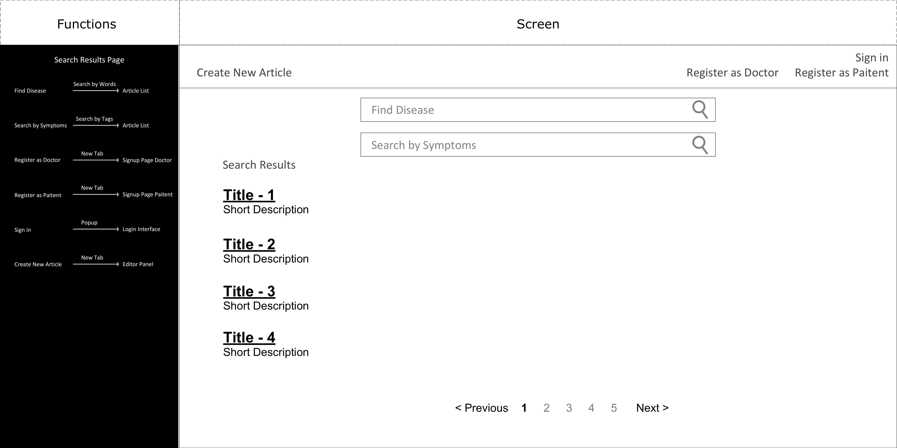
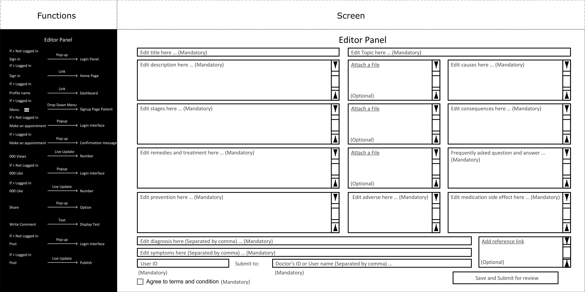
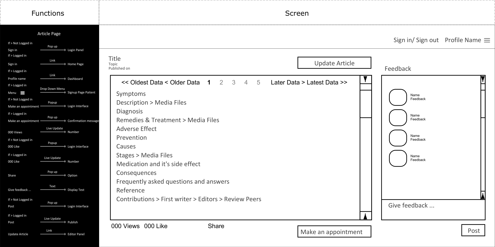
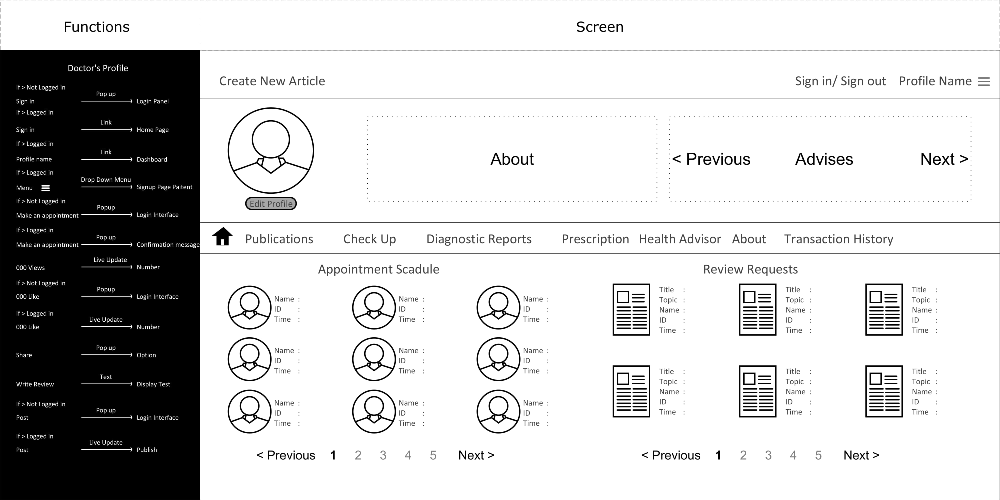
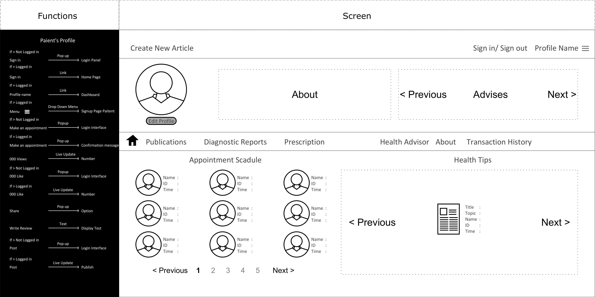
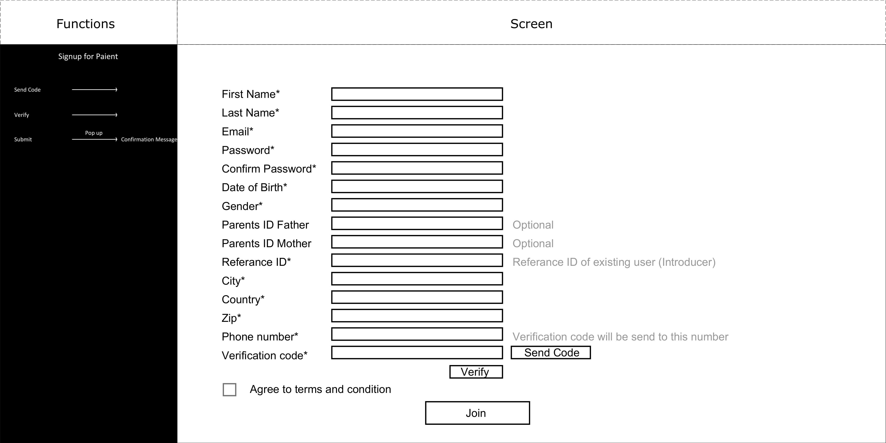

<h2 align=center>
ONLINE MEDICATION BASED PROJECT
</h2>

---

## **PROJECT INTRODUCTION**
#### **Online Medication Based Project is a website where patients and doctors can communicate through this website post articles regarding any disease or symptoms. Doctors needs verify the articles to make it publicly available.**

## **HOW TO SETUP**
#### 1. Install Node.js and MongoDB on your computer.

#### 2. Download this code, and from command prompt run:

        npm init

        npm install --save body-parser express ejs http mongodb mongoose

        npm install passport passport-local passport-local-mongoose express-session method-override connect-flash

        npm install -g nodemon

#### 3. To run the code, run:

        nodemon server/server.js

#### 4. In the browser open http://localhost:3000/, and you should see the index page

## **PROJECT DOCUMENTAION**

* This is the Home Page of my site where user can search by disease or symptomps to view verified articles.

* Search Results will show up like the image below. to view this in details user needs to click on the title

* Editor Panel Where user can post a new Article

* This is the view of an Article where user can give their feedback or make an appoinment with doctor who wrote this article.

* Doctors Profile View

* Patients Profile View

* Signup page for Doctor

 

* Signup page for Patients

